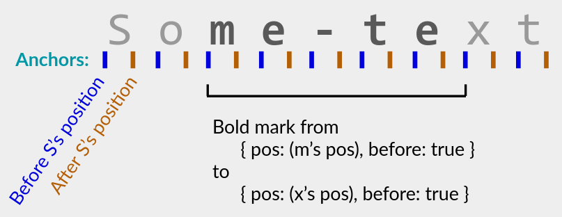

# list-formatting

Inline formatting for a list, e.g., collaborative rich text

- [About](#about)
- [Concepts](#concepts)
- [API](#api)
- [Performance](#performance)
- [Demos ↗️](https://github.com/mweidner037/list-demos)

## About

This library complements [list-positions](https://github.com/mweidner037/list-positions#readme). It lets you add _inline formatting_ to any list from that library: bold, font size, hyperlinks, etc. Inline formatting is a key component of rich text, and you can also use it for [spreadsheet rows/columns](https://mattweidner.com/2023/09/26/crdt-survey-2.html#spreadsheet-formatting) and other lists.

Each formatting _mark_ is defined in terms of `Position`s from the list-positions library, independent of a specific list or text string. So you can store formatting marks separately from the list itself, or share marks between multiple lists. In particular, you can share marks between lists on different devices, enabling DIY collaborative rich-text editing.

### Example Use Cases

1. Standard collaborative rich-text editing.
2. Store annotations on a text document, in the style of [atJSON](https://github.com/CondeNast/atjson#what-does-a-document-look-like) but with the array indices replaced by immutable _anchors_ that automatically accommodate future edits.
3. In a rich-text editor with suggested changes, you could store suggested formatting marks separately and use `Formatting.addMark`/`deleteMark` to toggle between the current vs suggested formatting.
4. Server authority: A user can optimistically add a formatting mark to their local instance, send it to a server, and then delete the mark if the server rejects it (e.g., it was outside the range that the user is allowed to edit).

## Concepts

list-formatting implements the core of the [Peritext rich-text CRDT](https://www.inkandswitch.com/peritext/) (though it is not itself a CRDT). It uses many of Peritext's concepts, which the previous link describes in detail; here is a self-contained summary.

### Anchors

An _anchor_ is a spot in a list that is immediately before or after a position. Concretely, it is a JSON object of type `Anchor`:

```ts
import { Position } from "list-positions";

type Anchor = {
  pos: Position;
  /**
   * True for a "before" anchor, false for an "after" anchor.
   */
  before: boolean;
};
```

### Marks

A _mark_ is an instruction to change the format of a range of values. For example, a mark may make a sentence bold, or add a hyperlink to a word.

Each mark starts and ends at an anchor. It sets a single key-value pair for all Positions between those anchors. You can visualize a mark as follows:



Concretely, a mark implements the interface `IMark`:

```ts
interface IMark {
  start: Anchor;
  end: Anchor;
  /** The format key, e.g., "bold" or "url". */
  key: string;
  /** The value at key, e.g., true or "npmjs.org". */
  value: any;
}
```

### From Marks to Formatting

A given list can have many marks, often overlapping with each other. The current set of marks determines the list's current format.

The general principles are:

1. Each mark affects all positions between its `start` and `end` anchors.
2. Overlapping marks for different keys don't interact with each other. Instead, they combine to give multi-key formats like `{ bold: true, "font-size": 12 }`.
3. Overlapping marks for the _same_ key are sorted in some way, e.g., using a timestamp (see [TimestampFormatting](#class-timestampformatting) below). The greatest mark under this sort order is the "winner" and determines the current value.

The sort order is how you override an existing mark, e.g., changing the font size from 12 to 16: you create a new mark that "wins" over the existing mark.

Formally, given the current set of marks, the current format at a position `pos` is an object of type `Record<string, any>`, given by:

- For each format key `key`, find the greatest mark such that `mark.key = key` and the mark _covers_ `pos` (`mark.start < pos < mark.end`).
- If `mark.value` is not null, then add the entry `{ key: mark.value }` to the format object. Otherwise, `key` is not present in the object.

The null-value rule lets you delete a format key: e.g., to change a range's format from `{ bold: true }` to `{}` (unbolding), add a new mark with `{ key: "bold", value: null }`.

## API

### Class Formatting

Class `Formatting<M extends IMark>` implements the above marks-to-formatting procedure. It is a local data structure storing a set of marks. Mutate the set using `addMark(mark)` and `deleteMark(mark)`. Other methods let you query the formatting that results from the current set of marks:

- `getFormat(pos)` returns the current format object at a Position.
- `formattedSlices(list)` returns an efficient representation of the current formatting projected onto a specific list `list`. Specifically, it returns an array of _slices_ in list order, where each slice is a list range `{ startIndex: number, endIndex: number }` with a single format.
- `formattedSpans()` returns an efficient representation of the current formatting, independent of a specific list. Specifically, it returns an array of _spans_ in list order, where each span is a range `{ start: Anchor, end: Anchor }` with a single format.

Class Formatting does not specify the sort order on marks. Instead, you choose the sort order, by extending the `IMark` interface with extra fields (type parameter `M`) and supplying a `compareMarks` function that uses those fields. Alternatively, you can use the [TimestampFormatting](#class-timestampformatting) class, which chooses a reasonable default sort order.

Misc features:

- `addMark` and `deleteMark` return changes to the current formatting.
- `save()` and `load(savedState)` save and load the current set of marks, similar to list-positions's save and load methods.
- `getActiveMarks(pos)` and `getMarks(pos)` give you more info about the marks covering a given Position.
- There is no way to modify an existing mark, and you should avoid modifying IMark objects in-place. Instead, delete the current mark and add a modified version.

**Warning:** Similar to list-positions's List class, you must [manage metadata](https://github.com/mweidner037/list-positions#managing-metadata) for a Formatting instance. Typically, you're already managing metadata for a List/Text/Outline/AbsList storing your actual values; it is then sufficient to share that list's `Order` with your Formatting instance, via the `order` constructor argument.

### Class TimestampFormatting

Subclass of `Formatting` that chooses a reasonable default sort order.

TimestampFormatting uses marks of type `TimestampMark`, which is a JSON object:

```ts
type TimestampMark = {
  start: Anchor;
  end: Anchor;
  key: string;
  value: any;
  // TimestampMark metadata fields:
  creatorID: string;
  timestamp: number;
};
```

To create a TimestampMark, use `TimestampFormatting.newMark`.

TimestampFormatting's sort order uses [Lamport timestamps](https://en.wikipedia.org/wiki/Lamport_timestamp), with ties broken by `creatorID`. This sort order works well in general, including in collaborative settings with or without a central server.

### Class RichList

Convenience wrapper for a List with TimestampFormatting.

RichList has an API similar to a traditional rich-text data structure, combining indexed access, values, and formatting in a single object. E.g., it has a `getFormatAt(index)` method.

Notable methods:

- `insertWithFormat(index, format, ...values)`: Inserts values and applies new formatting marks as needed so that the values have the exact given format. This is a common operation when working with a rich-text editor: the editor tells you to insert some new values and what format they should have.
- `format(startIndex, endIndex, key, value, expand?)`: Formats the slice from `startIndex` to `endIndex` so that the given format key maps to `value`, by adding a new mark.
- `formattedValues()`: Returns an efficient representation of the list's values and their current formatting. It is similar to [Quill's Delta format](https://quilljs.com/docs/delta/).

For other operations, you act on the List or TimestampFormatting directly. E.g., to delete a value, call `richList.list.deleteAt(index)`; to add a mark received from a collaborator, call `richList.formatting.addMark(mark)`.

RichList's `save()` and `load(savedState)` methods save the List, TimestampFormatting, and Order (metadata) states in a single JSON object. You can also save and load them separately.

If you don't want to use RichList (e.g., because you are using an Outline instead of a List, or marks besides TimestampMarks), you can access the same functionality using the [Utilities](#utilities) below. Consider reading the [RichList source code](./src/rich_list.ts).

### Utilities

- `diffFormats(current, target)`: Returns changes (including null for deletions) to turn the `current` format into `target`. Core logic behind `RichList.insertWithFormat`.
- `sliceFromSpan`, `spanFromSlice`: Convert between list-independent spans `{ start: Anchor, end: Anchor }` and list-specific slices `{ startIndex: number, endIndex: number }`.
- `Anchors` static object: min and max Anchors, `equals` and `compare` functions for Anchors, and `indexOfAnchor`.

## Performance

<!-- TODO: benchmarks -->

Benchmarks are to-do. However, this library's implementation is similar to [Collabs's](https://collabs.readthedocs.io/en/latest/) [CRichText](https://collabs.readthedocs.io/en/latest/api/collabs/classes/CRichText.html) and should have similar speed and metadata overhead. Cloud benchmarks showed that Collabs could handle [100+ simultaneous active users](https://arxiv.org/abs/2212.02618) in a collaborative rich-text editor with frequent formatting operations, exceeding Google Docs' scalability.
